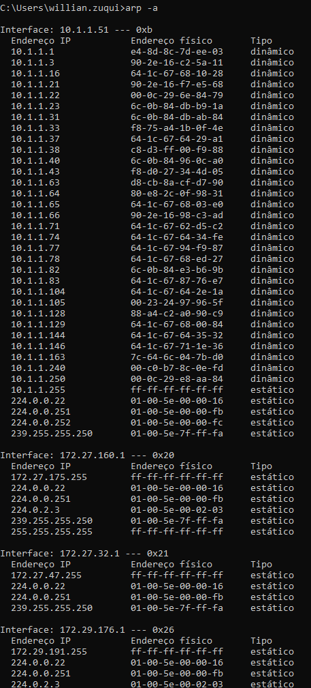
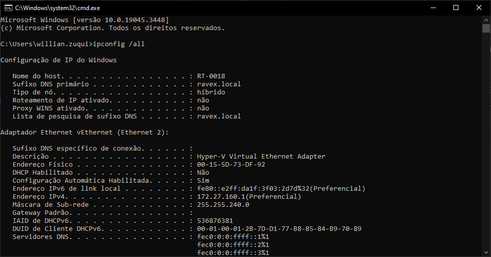

# Tabela ARP

É uma tabela que contém o endereço MAC de todos os dispositivos da rede. O endereço MAC é um endereço físico, único e permanente. O endereço MAC é gravado na memória ROM da placa de rede.
Estabelecido pela IEEE (Institute of Electrical and Electronics Engineers) e é composto por 48 bits (6 bytes) representados por 12 dígitos hexadecimais.
Onde os 6 primeiros dígitos identificam o fabricante e os 6 últimos identificam o dispositivo.

Exemplo: `00:0A:E4:36:00:02` ou `00-0A-E4-36-00-02`

Você pode ver todos os vendors no site [https://standards-oui.ieee.org/](https://standards-oui.ieee.org/)
Para ver no Windows você pode usar o comando `arp -a` ou `arp -g` no Linux.
Se quiser ver com qual é o IP da sua placa de rede basta usar o comando `ipconfig /all` no Windows ou `ifconfig` no Linux.

