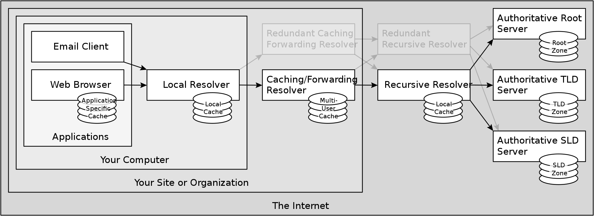
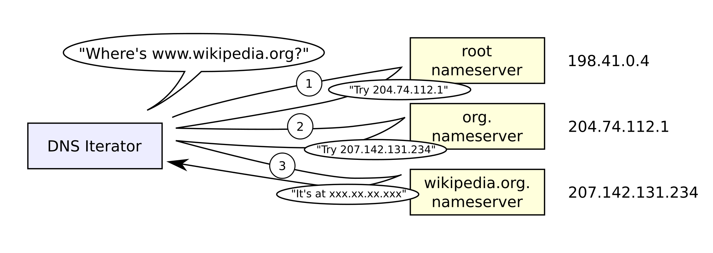

# DNS (Domain Name System)

É um sistema de nomenclatura hierárquico e `distribuído` para computadores, serviços ou outros recursos na Internet ou outras redes `IP`. Ele associa várias informações a `nomes de domínio` atribuídos a cada uma das entidades associadas.
Mais especificamente, ele traduz `nomes de domínio` para endereços `IP` necessários para localizar e identificar serviços de computadores e dispositivos de rede.

O DNS é uma arquitetura `client/server`, ouse ja uma aplicação que roda em um servidor sobre a porta `UDP/53`.



## Hierarquia

Seria inviável por questões de `escalabilidade` armazenar todos os pares de domínio em um único servidor, por esse motivo ele é um serviço `distribuído` que incluem:

- **Disponibilidade**: se um único servidor DNS falhasse, o serviço se tornaria indisponível para o mundo inteiro
- **Volume de tráfego**: o servidor deveria tratar os pedidos DNS do planeta inteiro
- **Distância**: parte dos usuários estaria muito distante do servidor, gerando grandes atrasos para resolver pedidos DNS
- **Manutenção de banco de dados**: deveria armazenar uma quantidade enorme de dados e teria que ser atualizado com frequência muito alta (assim que um novo domínio fosse associado a um endereço IP)

A solução encontrada foi usar `bando de dados distribuído` e `hierárquico`. Os servidores DNS se dividem nas seguintes categorias:

- Servidores-raiz
- Servidores de domínio de topo (TLD _Top Level Domain_)
- Servidores com autoridade



### Servidores-raiz

No topo estão os **13 servidores raiz**. Um servidor-raiz (_root name server_). A sua função é responder diretamente às requisições de registro da `zona raiz` e e retornando uma lista dos servidores de nome designados para o `domínio de topo` apropriado.

### Servidores de domínio de topo (TLD _Top Level Domain_)

Cada domínio é formado por nomes separados por pontos. O nome mais à direita é chamado de `domínio de topo`. Exemplos de domínios de topo são `.com`, `.org`, `.net`, `.edu`, `.inf`, `.gov`. Há também terminações orientadas a países, chamados de `Código de País` para `Domínios de Topo/Primeiro Nível` (_Country Code Top Level Domains_). Por exemplo `.br`, `.ar`, `.ar` e assim por diante. Há também combinações, como `.com.br`, `.com.ar` e `.com.ar`.

### Servidores com autoridade

O servidor com autoridade de um domínio possui os registros originais que associam aquele domínio a seu endereço de IP. Toda vez que um domínio adquire um novo endereço, essas informações devem ser adicionadas a pelo menos **dois servidores** autoritativos. Um deles será o servidor autoritativo `principal` e o outro, o `secundário`. Isso é feito para `minimizar o risco` de, em caso de erros em um servidor DNS, perder todas as informações originais do endereço daquele domínio.

## Referências

- [https://en.wikipedia.org/wiki/Domain_Name_System](https://en.wikipedia.org/wiki/Domain_Name_System)

<!-- ### Tópicos

- Dig
- Localhost
- C:\Windows\System32\Drivers\etc\hosts ou /etc/hosts
- CNAME
- A OU AAAA
- TXT
- MX

## DIG

Dig (Domain Information Groper) é uma linha de comando que **executa a pesquisa de DNS por consultas de nomes de servidores e mostra o resultado para você**

```powershell
choco install -y bind-toolsonly
``` -->
