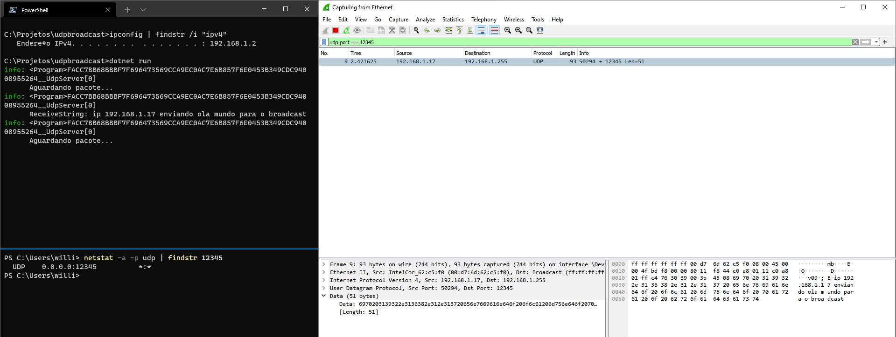
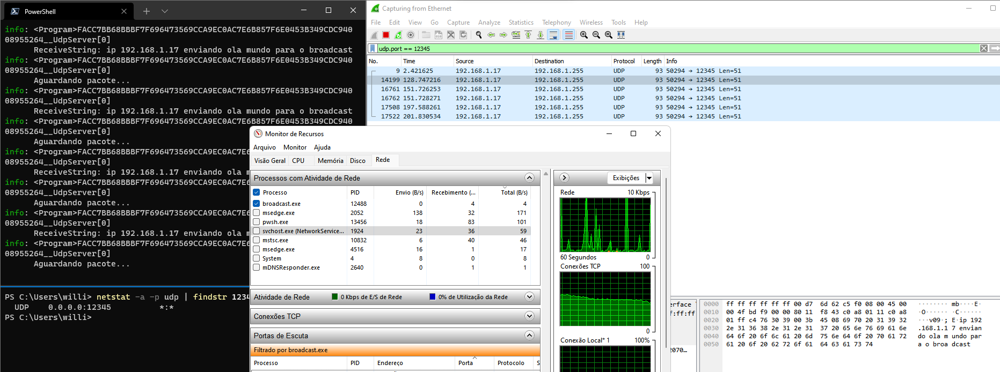
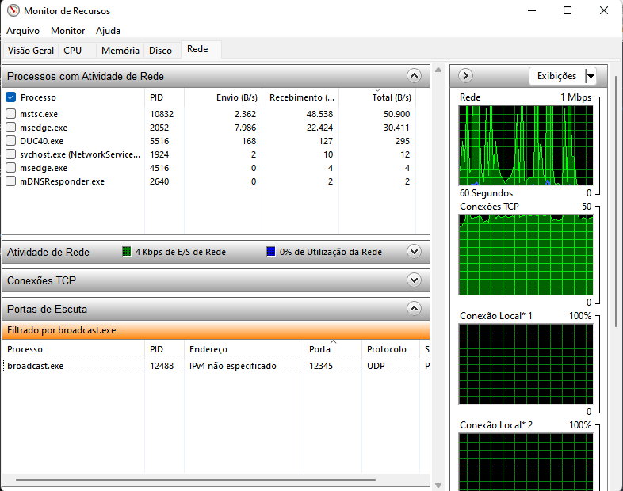

# 👨‍👩‍👦 Broadcast

É sempre o último endereço de uma rede. Exemplo: para uma rede 192.168.0.0/24 o IP de broadcast é 192.168.0.255

Representação de um pacote broadcast


## Consigo fazer bind em um IP de broadcast?

Não, não é possível fazer bind em um IP de broadcast. O bind é feito em um endereço IP específico, e o IP de broadcast não é um endereço IP específico, mas sim um endereço de rede. Então o que você pode fazer é fazer bind em um endereço IP específico e enviar pacotes para o IP de broadcast da rede.

No caso do C# você até consegue fazer bind em um IP de broadcast, mas ele vai ignorar o IP de broadcast e vai receber pacotes de qualquer IP da rede.

### Vamos fazer um programa C# (🔨 mão no código)

```csharp
using System.Net;
using System.Net.Sockets;
using System.Text;

var xBuilder = Host.CreateDefaultBuilder(args)
    .ConfigureServices(services =>
    {
        services.AddHostedService<UdpServer>();
    })
    .Build();

xBuilder.Run();

file class UdpServer : BackgroundService
{
    private readonly ILogger<UdpServer> _logger;

    public UdpServer(ILogger<UdpServer> logger)
    {
        _logger = logger;
    }

    protected override async Task ExecuteAsync(CancellationToken stoppingToken)
    {
        var xUdpClient = new UdpClient(12345);
        var xRemoteIpEndPoint = new IPEndPoint(IPAddress.Broadcast, 0);

        while (!stoppingToken.IsCancellationRequested)
        {
            _logger.LogInformation("Aguardando pacote...");
            var xReceiveBytes = xUdpClient.Receive(ref xRemoteIpEndPoint);
            var xReceiveString = Encoding.ASCII.GetString(xReceiveBytes);
            _logger.LogInformation("ReceiveString: {String}", xReceiveString);
        }

        await Task.CompletedTask;
    }
}
```

> Observe que a constante IPAddress.Broadcast é um IP de broadcast

Agora vamos para o terminal e vamos pegar nosso IP com o comando `ipconfig`.

Depois vamos executar o programa com o comando `dotnet run`

Em um segundo terminal vamos digitar o comando `netstat -a -p upd` para ver as conexões UDP ativas. E veja que estranho o IP de broadcast não aparece na lista de conexões ativas. Mas sim o IP `0.0.0.0:12345`, isso porque ele está escutando qualquer IP da rede. O que aprendemos com isso é que não é possível fazer bind em um IP de broadcast que seria `192.168.1.255`

Ainda no mesmo computador vou abrir o programa `wireshark` para ver os pacotes que estão sendo enviados e recebidos.

Em outro computador vou executar o programa `packagesender` e vou enviar um pacote UDP para o o IP `192.168.1.255` sobre a porta `UDP 12345`.

Agora veja o resultado:


#### Alterando o programa para forçar o bind no IP de broadcast

Vamos alterar a linha do `IPEndPoint` e tentar forçar o bind no IP de broadcast.

```csharp
var xRemoteIpEndPoint = new IPEndPoint(IPAddress.Parse("192.168.1.255"), 0);
```

Executar o programa e olhe só o que aconteceu:

Continua recebendo pacotes



Mas ainda está ouvindo o IP `0.0.0.0:12345`:



## Referências

- [https://embarcados.com.br/udp-broadcast/](https://embarcados.com.br/udp-broadcast/)
- [https://www.wireshark.org/](https://www.wireshark.org/)
- [https://packetsender.com/](https://packetsender.com/)
