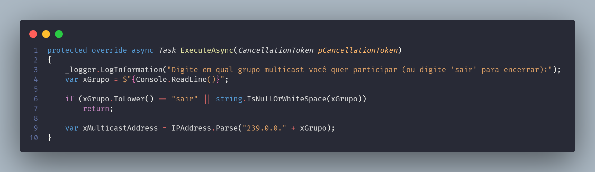
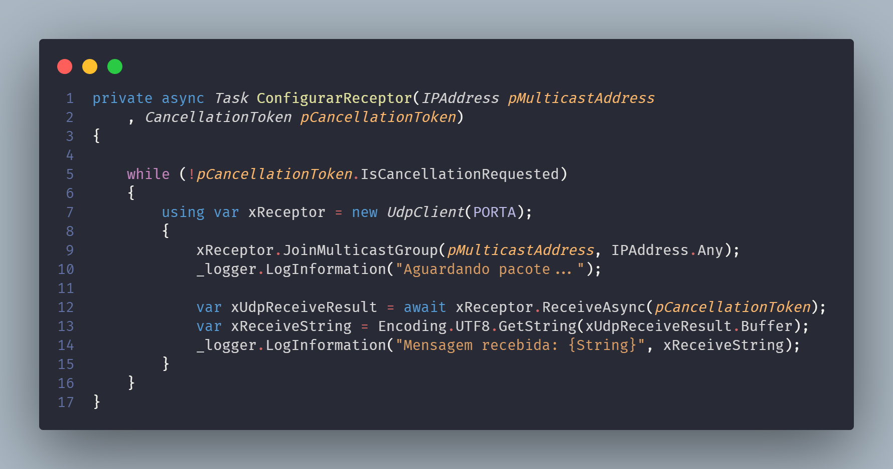
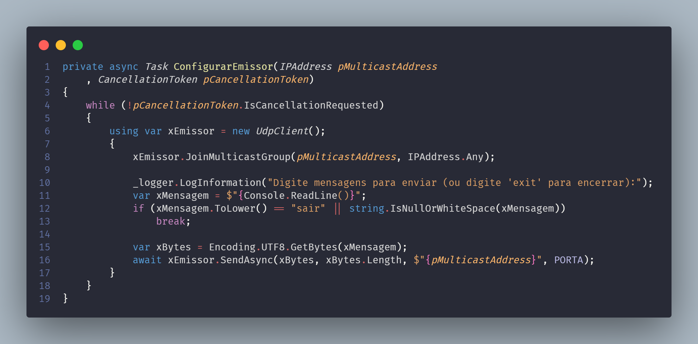

# 👨‍👩‍👦 Multicast

Multicasting é um método ou técnica de transmissão de um pacote de dados para múltiplos destinos ao mesmo tempo. Durante uma transmissão Multicast, o transmissor envia os pacotes de dados somente uma vez, ficando a cargo dos receptores captarem esta transmissão e reproduzi-la.

Algo interessante no multicast é que ele é mais utilizado em IPV6 já que o IPV6 não tem suporte a broadcast.

## Alguns conceitos-chave

- **Endereços de Grupo Multicast**: Em redes IP, os destinatários multicast são identificados por endereços de grupo multicast. Esses endereços estão dentro de um intervalo específico de endereço IP, geralmente no intervalo de `224.0.0.0` até `239.255.255.255`
- **Transmissor**: Um transmissor ou remetente multicast envia os dados para um endereço de grupo multicast específico. Os pacotes de dados enviados por um remetente multicast são distribuídos para todos os membros do grupo multicast
- **Membros do Grupo**: Os membros do grupo multicast são sistemas na rede que desejam receber os dados do remetente multicast. Eles se juntam a um grupo multicast especificando o endereço de grupo correspondente
- **Árvore de Distribuição**: A comunicação multicast utiliza árvores de distribuição para encaminhar os pacotes de dados de maneira eficiente. Existem dois tipos principais de árvores de distribuição: baseada na fonte e árvore compartilhada. Onde a árvore de distribuição baseada na fonte é criada de cada transmissor para os receptores e a árvore de distribuição compartilhada é criada a partir de um roteador multicast utilizada por todos os membros do grupo
- **Protocolos de Roteamento Multicast**: Para permitir a entrega eficiente de pacotes multicast na rede, os protocolos de roteamento multicast, como `PIM` (Protocol Independent Multicast) e o `IGMP` (Internet Group Management Protocol), são usados. Esses protocolos determinam como os pacotes multicast são encaminhados pela rede e como os membros do grupo multicast são gerenciados
- **Eficiência**: é mais eficiente em termos de largura de banda do que o `broadcast`, porque os pacotes multicast são entregues apenas aos membros interessados do grupo. Isso reduz o tráfego desnecessário na rede
- **Aplicações**: transmissão de vídeo e áudio em tempo real, atualizações de software em rede, distribuição de feeds de dados financeiros e muito mais. Ele é especialmente útil em cenários onde a mesma informação precisa ser entregue a um grande número de receptores simultaneamente

## Endereços de grupo multicast

| IP multicast address range      | Descrição                                                                                          | Roteáveis |
| ------------------------------- | -------------------------------------------------------------------------------------------------- | --------- |
| 224.0.0.0 até 224.0.0.255       | Multicast local                                                                                    | Não       |
| 224.0.1.0 até 224.0.1.255       | Multicast de gerenciamento                                                                         | Sim       |
| 224.0.2.0 até 224.0.255.255     | AD-HOC bloco 1, aplicativos que não se encaixam em nenhuma outra finalidade descrita               | Sim       |
| 224.1.0.0 até 224.1.255.255     | Reservado                                                                                          |           |
| 224.3.0.0 até 224.4.255.255     | AD-HOC bloco 2                                                                                     | Sim       |
| 225.0.0.0 até 231.255.255.255   | Reservado                                                                                          |           |
| 232.0.0.0 até 232.255.255.255   | Bloco reservado para uso                                                                           | Sim       |
| 233.0.0.0 até 233.251.255.255   | GLOP, multicast público atribuído estaticamente para editores e provedores de serviços de internet | Sim       |
| 233.252.0.0 até 233.255.255.255 | AD-HOC bloco 3                                                                                     | Sim       |
| 234.0.0.0 até 234.255.255.255   | Baseado em prefixo Unicast                                                                         | Sim       |
| 235.0.0.0 até 238.255.255.255   | Reservado                                                                                          |           |
| 239.0.0.0 até 239.255.255.255   | Escopo administrativo, para uso privado dentro de uma organização                                  | Sim       |

## Vamos fazer um programa C# (🔨 mão no código)

### Requisitos funcionais

- [x] Criar um servidor UDP que escolhe em qual grupo multicast ele vai se juntar
- [x] criar um cliente UDP que envia mensagens para o grupo multicast escolhido

O código está implementado neste mesmo repositório no [github](https://github.com/wzuqui/obsidian) (na pasta samples/introducao-a-back-end/capitulo-1/ip/multicast) mas vou destacar algumas partes aqui.

Caso queria baixar o cliente/servidor basta baixar o executável neste [link](https://github.com/wzuqui/obsidian/tree/main/samples/introducao-a-back-end/capitulo-1/ip/multicast/publish/multicast.7z). O servidor é o padrão e basta executar o arquivo, já o cliente tem que passar como parâmetro em um terminal a flag `emissor=true`.

> Código aguarda o `Console.ReadLine`, perguntando em qual grupo multicast você quer participar e após isso observe o código `IPAddress.Parse` que converte o que o usuário escreveu para um objeto do tipo `IPAddress` concatenando o IP `239.0.0.` isso sinaliza que o IP é um IP multicast no range de `escopo administrativo` utilizado para uso privado dentro de uma organização.

> Código acima inicializa o servidor UDP e se junta ao grupo multicast que o usuário escolheu. Observe que o IP do grupo multicast é passado com uma chamada de função `JoinMulticastGroup` que é uma função da classe `UdpClient` que é responsável por se juntar a um grupo multicast.

> Código acima inicializa o cliente UDP e envia mensagens para o grupo multicast que o usuário escolheu. Observe que o IP do grupo multicast também é passado com uma chamada de função `JoinMulticastGroup` que é uma função da classe `UdpClient` que é responsável por se juntar a um grupo multicast. Outra detalhe para observar é que o IP `destino` utilizado no `SendAsync` é o IP do grupo multicast e não um endereço de `host` como por exemplo `10.1.1.51`.

## Aplicações

- Redes de distribuição de conteúdo
- Streaming de vídeo
- Streaming de áudio
- Atualizações de software em rede
- Distribuição de feeds de dados financeiros
- Jogos online
- Telefonia IP
- Aplicações de videoconferência
- Aplicações de monitoramento de rede

## Referências

[https://www.devmedia.com.br/como-implantar-o-ip-multicast/31300](https://www.devmedia.com.br/como-implantar-o-ip-multicast/31300)

[https://learn.microsoft.com/pt-br/dotnet/api/system.net.sockets.udpclient.joinmulticastgroup?view=net-7.0](https://learn.microsoft.com/pt-br/dotnet/api/system.net.sockets.udpclient.joinmulticastgroup?view=net-7.0)

[https://www.ic.unicamp.br/~nfonseca/MO648/doc/multicast-2013.pdf](https://www.ic.unicamp.br/~nfonseca/MO648/doc/multicast-2013.pdf)

[https://github.com/individuwill/mcast](https://github.com/individuwill/mcast)

[https://www.codeproject.com/Tips/1175059/Test-Multicast-IP-Network-Traffic](https://www.codeproject.com/Tips/1175059/Test-Multicast-IP-Network-Traffic)

[https://en.wikipedia.org/wiki/Multicast_address](https://en.wikipedia.org/wiki/Multicast_address)
